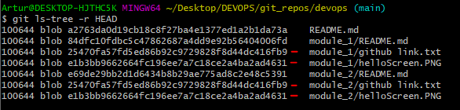

#DevOps majasdarbs Nr.2
## Artūrs Višņevskis

### GIT neredz starpību, hash sakrīt.

### 16. Kādas izmaiņas tika veiktas iepriekšējās nedēļas laikā.
#### Ver.1

#### Ver.2

### 17. Autors - “Laura Pacilio”

### 18. Lauras commiti pagājušā gada septembrī

### 19. Vai Laura ir veikusi commit vakar? Nē!

### * Rezultāti no pagājušā gada 20 līdz 21 aprīlim... - Invalid "Committer date"
